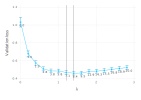

# ContextualLasso

Julia implementation of the contextual lasso from the paper ‘The
contextual lasso: Sparse linear models via deep neural networks’.

## Installation

To install `ContextualLasso` from GitHub, run the following code:

``` julia
using Pkg
Pkg.add(url = "https://github.com/ryan-thompson/ContextualLasso.jl")
```

## Usage

The `classo()` function fits a contextually sparse linear model using
explantory features `x`, contextual features `z`, and response `y`.

``` julia
using ContextualLasso, LinearAlgebra, Random, Statistics

Random.seed!(2022)

n = 1000 # Number of samples
p = 20 # Number of explanatory features
m = 2 # Number of contextual features
s = 0.1 # Explanatory feature sparsity

# Generate explanatory features
x = randn(n, p)

# Generate contextual features
z = rand(n, m) .* 2 .- 1

# Generate coefficients on hyperspheres
center = rand(p, m) .* 2 .- 1
radius = quantile.(eachcol([norm(z[i, :] - center[j, :], 2) for i in 1:n, j in 1:p]), s)
beta = [float(norm(z[i, :] - center[j, :], 2) < radius[j]) for i in 1:n, j in 1:p]

# Generate response
mu = dropdims(sum(x .* beta, dims = 2), dims = 2)
y = mu + randn(n)
y_val = mu + randn(n)

# Fit a contextual lasso model with three hidden layers of 16 neurons each
fit = classo(
    x, z, y, x, z, y_val, intercept = false, hidden_layers = [16, 16, 16], 
    lambda_n = 15, verbose = false
    )
plot(fit) |> display
```



``` julia
# Compare estimation with least squares estimator
beta_classo = coef(fit, z)
@show norm(beta - beta_classo, 2)
beta_ls = repeat((inv(x' * x) * x' * y)', n)
@show norm(beta - beta_ls, 2);
```

    norm(beta - beta_classo, 2) = 28.31139922880831
    norm(beta - beta_ls, 2) = 43.0425159160224

``` julia
# Compare prediction with least squares estimator
mu_classo = predict(fit, x, z)
@show norm(mu - mu_classo, 2)
mu_ls = sum(x .* beta_ls, dims = 2)
@show norm(mu - mu_ls, 2);
```

    norm(mu - mu_classo, 2) = 20.721030111118452
    norm(mu - mu_ls, 2) = 41.472454429343834
